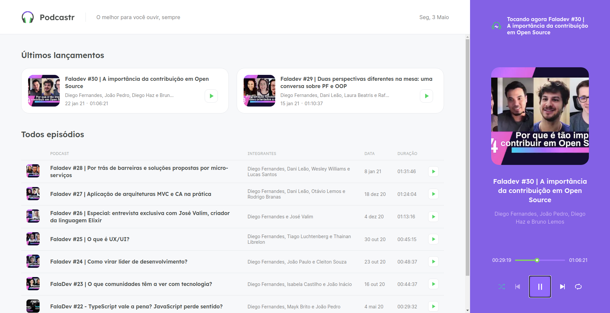
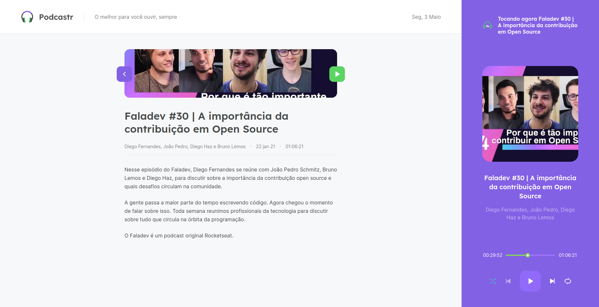

<div align=center>

  
  <br>
  <br>

<h3>

Projeto desenvolvido na #NextLevelWeek5 - promovida pela [Rocketseat], com **NextJS**, **Typescript** e **Sass**.

</h3>





</div>

## 📚 **Sobre**

Plataforma de transmissão de podcast. 

<br>

### 📌  **Tecnologias utilizadas**
- [ReactJS]
- [NextJS]
- [TypeScript]
- [Sass]
- [date-fns]
- [JSON-server]
- [axios]
- [rc-slider]

<br>

### 🎨 **Layout**
- [Figma]

<br>

### 🚀 **Mão na massa**

```bash
# Clone este repositório
$ git clone https://github.com/Joao-Augusto-Oliveira/podcastr

# Acesse a pasta do projeto no terminal/cmd
$ cd podcastr

# Instale as dependências
$ yarn

# Execute o JSON server 
$ yarn server

# Execute a aplicação em modo de desenvolvimento
$ yarn dev

```

<br>
<br>

<h3 align="center">
Feito com 💜 por <a href="https://www.linkedin.com/in/joão-augusto-oliveira-dos-santos-9b0693195">João Augusto</a>
<br><br>
 
  
</a>
</h3>

<!-- Links -->

[Rocketseat]: https://rocketseat.com.br/
[ReactJS]: https://reactjs.org
[NextJS]: https://nextjs.org/
[TypeScript]: https://www.typescriptlang.org/
[Sass]: https://sass-lang.com/
[date-fns]: https://date-fns.org/v2.20.1/docs/format
[JSON-server]: (https://github.com/typicode/json-server
[axios]: https://github.com/axios/axios
[rc-slider]: https://slider-react-component.vercel.app/
[Figma]: https://www.figma.com/file/UwFEntsHpHYJlHNQAQr4gA/Podcastr?node-id=160%3A2761

